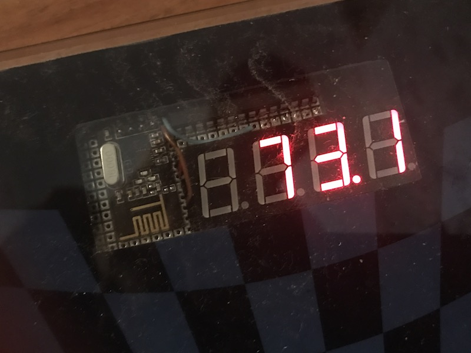
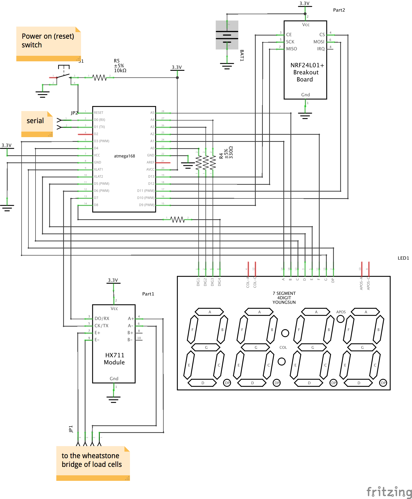

# Bathroom scale with Bluetooth Low Energy 

Because everything comes better with Bluetooth! 😀 

## Features ##

<ul>
<li>Can measure up to 120kg of load</li>
<li>LED indicators make it easy to use in the dark</li>
<li>Broadcast weight over BTLE (iOS and Android apps available)</li>
<li>Automatically turns off after 15 seconds</li>
<li>Can live for years on a single coin battery</li>
<li>Built on cheap components</li>
<li>Geek-porn enabled in my case (easy opt out with any tape or plastic thing)</li>
</ul>





## Requirements ##

Okay, there are some things you have to do to get it working:

* you definitely need HX711 chip or module to amplify signal from load cells. I used [this one](https://www.itead.cc/hx711-dual-channel-weighing-sensor-module.html) but there is variety of other from many stores including sparkfun. Also you need a [HX711](https://github.com/bogde/HX711) library for arduino (I used [master branch with fb31428 ](https://github.com/bogde/HX711/tree/fb3142867fbbb28fe771249ebaadeb4abf1702a1) latest commit)
* you can optionally supply your scale with seven-segment led indicator, then you need also [SevSeg](https://github.com/DeanIsMe/SevSeg) library (I used version 3.1)
* if you want to send over bluetooth, you need nRF24l01+ module and two libraries: [RF24](https://github.com/TMRh20/RF24) and [BTLE](https://github.com/floe/BTLE). The former needed to control the chip, the latter mimics BTLE beacon packet format.
* now you have to decide: either you calibrate you scale right now, or you need two more pins for Serial communication in the future. If you want all above and want to keep Serial port available (like I do), then you out of pins already, so you need to use PB6 & PB7 as additional pins. Check the paragraph below. 

### Additional pins on PB6 & PB7 ###

Please be aware that this makes impossible to use this sketch with regular Arduino boards because there is an Quarts oscillator connected to these pins. But on the breadbord it's fine to use internal oscillator and free PB6 and PB7 pins. 

To do that you have to create a separate pins variant for a standard arduino core: copypaste `standard` folder inside `hardware/arduino/avr/variants/` of your arduino installation directory, I named it `standardpb67`. Inside of `pins_arduino.h` file find the `digital_pin_to_port_PGM` and `digital_pin_to_bit_mask_PGM` definition and replace them to match [this gist](https://gist.github.com/kabturek/1082244). 

Also, because I was using atmega8A on a breadboard with this [hardware definitions](https://github.com/sleemanj/optiboot/blob/master/dists/README.md), I needed to modify them as well: edit `boards.txt`, add following:
```
# Additional pins 20-21
# ~~~~~~~~~~~~~~~~~~~~~~~~~~~~~~~~~~~~~~~~~~~~~~~~~~~~~~~~~~~~~~~~~~~~~~~~~~~~~~

menu.pb67       = Additional pins 20-21
atmega8_diy.menu.pb67.pb67on = PB6 & PB7
atmega8_diy.menu.pb67.pb67on.build.variant=arduino:standardpb67

atmega8_diy.menu.pb67.pb67off = No
atmega8_diy.menu.pb67.pb67off.build.variant=arduino:standard
```
Remember to choose this checkmark in menu before upload!
